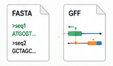
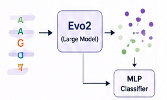
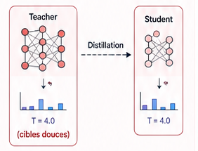
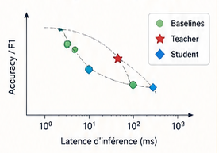
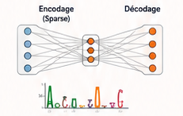

<h1 align="center">🧬 AI & Biologie: Entrainement d'un model de classification d'ADN' & Introduction a la distillation de model</h1>

<p align="center">
  
  
  
  
  
  
</p>

<br>
<a href="presentation.html">
  <div align="center" style="height:10em;display:flex;align-items:center;justify-content:center;background:linear-gradient(90deg,#5eead4,#818cf8);border-radius:12px;margin:1.2em 0;">
    <span style="font-size:1.6em;font-weight:800;color:#04101a;letter-spacing:.06em;">
      🎬 PRÉSENTATION
    </span>
  </div>
</a>
<br>

## 🗺️ Vue d'ensemble

| | Jour | Thème | Notebook |
|---|---|---|---|
| 🟦 | **0** | Kickoff & prépa données | `presentation` |
| 🟩 | **1** | Biologie + baselines | `00_biology_intro...` · `01_kmer_and_cnn...` |
| 🟪 | **2** | Embeddings Evo2 | `02_evo2_embeddings...` |
| 🟥 | **3** | Distillation | `03_knowledge_distillation...` |
| 🟨 | **4** | Analyse d'efficacité | `04_compression_analysis...` |
| 🟧 | **5** | Bonus + présentations | `bonus_sparse_autoencoder...` |

**Progression du pipeline :** `🟩🟩🟩🟩🟩`
<br>
<br>

## 📁 Anatomie d'un dossier de jour

```text
week4/
  day1/  📗 Biologie + baselines
    ├── <notebooks>.ipynb   ← incomplet : des TODO à remplir, guidés étape par étape
    ├── src/                ← copie locale des modules dont ce jour a besoin — également
    │                          incomplète là où le TODO est l'objectif pédagogique du jour
    └── solution/           ← clone complet : notebooks + src entièrement remplis
  day2/ 
  …
```

<table width="100%"><tr><td bgcolor="#f3f4f6">

### 🎯 Objectif & méthode de travail

Chaque jour suit le même rythme :

1. 📢 **Nous annonçons l'objectif du jour** - ce qu'on construit et pourquoi (voir le tableau *Vue d'ensemble* ci-dessus).
2. ⬆️ **Nous mettons à jour le dépôt GitHub** avec le nouveau matériel (`dayN/` : notebooks + `src/` à compléter).
3. ⬇️ **Vous récupérez le matériel du jour** avec une seule commande (voir ci-dessous).
4. ✍️ **Vous complétez les objectifs** — les `# TODO` des notebooks et de `src/`, guidés étape par étape.
5. 🙋 **Nous passons entre les groupes** — posez toutes vos questions, on est là pour ça.

#### 📥 Récupérer le matériel

**La toute première fois** (cloner le dépôt) :

```bash
git clone https://github.com/Genereux-akotenou/EEIA-bioAI-Workshop.git
cd EEIA-bioAI-Workshop
```

**Chaque jour ensuite** (récupérer le nouveau matériel) :

```bash
cd EEIA-bioAI-Workshop
git pull origin master
```

> ⚠️ Travaillez dans un dossier à vous (ex. `mon_travail/`) ou gardez une copie de vos
> réponses — un `git pull` peut entrer en conflit avec des fichiers que vous avez modifiés.
> En cas de souci, **appelez-nous**, on règle ça ensemble.

</td></tr></table>
<br>

<!-- ******************************** -->
<!-- ******************************** -->
<div align="center">
  
</div>
<table width="100%"><tr><td bgcolor="#f3f4f6">

## 🟩 Jour 1: Biologie + baselines → [`../day1/`](../day1/)

- 📓 [`00_biology_intro_and_data_setup.ipynb`](../day1/00_biology_intro_and_data_setup.ipynb) : dogme central, FASTA/GFF bruts, d'où viennent les étiquettes.
- 📓 [`01_kmer_and_cnn_baselines.ipynb`](../day1/01_kmer_and_cnn_baselines.ipynb) : k-mer + régression logistique, one-hot + CNN.
- 📓 `src/` : `data.py` (complet) · `featurize.py` + `models/baselines.py` + `eval.py` (**incomplet**).

<div style="margin:1rem 0;padding:1rem 1.25rem;border-left:5px solid #f59e0b;background:#fff8e6;border-radius:6px;">
  <h4 style="margin:0 0 .6rem 0;">🏁 Checkpoint</h4>

  <p style="margin:.3rem 0;">
    Chaque groupe doit reporter les métriques suivantes pour <strong>les deux baselines</strong> :
  </p>

  <ul style="margin:.4rem 0 0 1.2rem;">
    <li><strong>Accuracy</strong></li>
    <li><strong>F1-score</strong></li>
    <li><strong>Nombre de paramètres</strong></li>
    <li><strong>Latence d'inférence</strong></li>
  </ul>
</div>

<div style="margin:1rem 0;padding:1rem 1.25rem;border-left:5px solid #22c55e;background:#f0fdf4;border-radius:6px;">
  <h4 style="margin:0 0 .6rem 0;">🔓 Solution</h4>

  <p style="margin:0;">
    La solution complète <strong>(notebooks + code source)</strong> n'est pas fournie dans cette version.
    Elle sera partagée avec vous après le checkpoint.
  </p>
  <!--
  <p style="margin-top:.6rem;">
    📂 <a href="../day1/solution/"><code>../day1/solution/</code></a>
  </p>
  -->
</div>
</td></tr></table>
<div style="height:0.5em; width: 100%; background: #ddd;"></div>
<br>
<br>


<!-- ******************************** -->
<!-- ******************************** -->
<div align="center">
  
</div>

<table width="100%"><tr><td bgcolor="#f3f4f6">

## 🟪 Jour 2 : Embeddings Evo2 → [`../day2/`](../day2/)

- 📓 [`02_evo2_embeddings_and_classifier.ipynb`](../day2/02_evo2_embeddings_and_classifier.ipynb):  charger les embeddings pré-calculés, entraîner la tête MLP, visualisation PCA/UMAP.
- 📓 `src/` : `embeddings.py` + `eval.py` (complets) · `models/classifier_heads.py` + `viz.py` (**incomplet**).

<div style="margin:1rem 0;padding:1rem 1.25rem;border-left:5px solid #8b5cf6;background:#f5f3ff;border-radius:6px;">
  <h4 style="margin:0 0 .6rem 0;">🏁 Checkpoint</h4>

  <p style="margin:0;">
    Le classifieur <strong>Evo2</strong> doit obtenir de meilleures performances que les
    <strong>deux baselines du Jour&nbsp;1</strong>.
  </p>
</div>

<div style="margin:1rem 0;padding:1rem 1.25rem;border-left:5px solid #22c55e;background:#f0fdf4;border-radius:6px;">
  <h4 style="margin:0 0 .6rem 0;">🔓 Solution</h4>

  <p style="margin:0;">
    La solution complète <strong>(notebooks + code source)</strong> sera partagée avec vous après le checkpoint.
  </p>

  <!--
  <p style="margin-top:.6rem;">
    📂 <a href="../day2/solution/"><code>../day2/solution/</code></a>
  </p>
  -->
</div>

</td></tr></table>
<div style="height:0.5em; width: 100%; background: #ddd;"></div>
<br><br>


<!-- ******************************** -->
<!-- ******************************** -->
<div align="center">
  
</div>

<table width="100%"><tr><td bgcolor="#f3f4f6">

## 🟥 Jour 3 : Distillation de connaissances → [`../day3/`](../day3/)

- 📓 [`03_knowledge_distillation.ipynb`](../day3/03_knowledge_distillation.ipynb) : INtroduction a la distaillation - teacher → student.
- 📓 `src/` : `data.py`, `embeddings.py`, `featurize.py`, `models/classifier_heads.py`, `eval.py` (complets, portés) · `models/distillation.py` (**incomplet**).

<div style="margin:1rem 0;padding:1rem 1.25rem;border-left:5px solid #ef4444;background:#fef2f2;border-radius:6px;">
  <h4 style="margin:0 0 .6rem 0;">🏁 Checkpoint</h4>

  <p style="margin:0;">
    Le modèle <strong>Student</strong> doit récupérer l'essentiel des performances du
    <strong>Teacher</strong> tout en étant significativement plus léger et plus rapide.
  </p>
</div>

<div style="margin:1rem 0;padding:1rem 1.25rem;border-left:5px solid #22c55e;background:#f0fdf4;border-radius:6px;">
  <h4 style="margin:0 0 .6rem 0;">🔓 Solution</h4>

  <p style="margin:0;">
    La solution complète <strong>(notebooks + code source)</strong> sera partagée avec vous après le checkpoint.
  </p>

  <!--
  <p style="margin-top:.6rem;">
    📂 <a href="../day3/solution/"><code>../day3/solution/</code></a>
  </p>
  -->
</div>
</td></tr></table>
<div style="height:0.5em; width: 100%; background: #ddd;"></div>
<br><br>


<!-- ******************************** -->
<!-- ******************************** -->
<div align="center">
  
</div>

<table width="100%"><tr><td bgcolor="#f3f4f6">

## 🟨 Jour 4 : Analyse de compression → [`../day4/`](../day4/)

- 📓 [`04_compression_analysis_and_wrapup.ipynb`](../day4/04_compression_analysis_and_wrapup.ipynb) : un seul graphique, tous les modèles construits cette semaine.
- 📓 `src/` : `viz.py` (**incomplet**, uniquement `plot_efficiency_tradeoff`).

<div style="margin:1rem 0;padding:1rem 1.25rem;border-left:5px solid #eab308;background:#fefce8;border-radius:6px;">
  <h4 style="margin:0 0 .6rem 0;">🏁 Checkpoint</h4>

  <p style="margin:0;">
    Produire le graphique d'efficacité comparant l'ensemble des modèles :
  </p>

  <ul style="margin:.5rem 0 0 1.2rem;">
    <li>Baselines</li>
    <li>Teacher</li>
    <li>Student</li>
  </ul>
</div>

<div style="margin:1rem 0;padding:1rem 1.25rem;border-left:5px solid #22c55e;background:#f0fdf4;border-radius:6px;">
  <h4 style="margin:0 0 .6rem 0;">🔓 Solution</h4>

  <p style="margin:0;">
    La solution complète <strong>(notebooks + code source, avec des chiffres d'exemple)</strong> sera partagée avec vous après le checkpoint.
  </p>

  <!--
  <p style="margin-top:.6rem;">
    📂 <a href="../day4/solution/"><code>../day4/solution/</code></a>
  </p>
  -->
</div>
</td></tr></table>
<div style="height:0.5em; width: 100%; background: #ddd;"></div>
<br><br>


<!-- ******************************** -->
<!-- ******************************** -->
<div align="center">
  
</div>

<table width="100%"><tr><td bgcolor="#f3f4f6">

## 🟧 Jour 5 : Piste bonus + présentations → [`../day5/`](../day5/)

- 📓 [`bonus_sparse_autoencoder_interpretability.ipynb`](../day5/bonus_sparse_autoencoder_interpretability.ipynb) — groupes optionnels/avancés.
- 📓 `src/` : `data.py`, `featurize.py`, `embeddings.py` (complets, portés) · `models/sae.py` + `viz.py` (**incomplet**).

<div style="margin:1rem 0;padding:1rem 1.25rem;border-left:5px solid #f97316;background:#fff7ed;border-radius:6px;">
  <h4 style="margin:0 0 .6rem 0;">🎤 Présentations finales</h4>

  <ul style="margin:0 0 0 1.2rem;">
    <li>Chaque groupe présente les résultats de son pipeline principal.</li>
    <li>Les groupes ayant réalisé la piste bonus présentent également leurs analyses SAE.</li>
  </ul>
</div>

<div style="margin:1rem 0;padding:1rem 1.25rem;border-left:5px solid #22c55e;background:#f0fdf4;border-radius:6px;">
  <h4 style="margin:0 0 .6rem 0;">🔓 Solution</h4>

  <p style="margin:0;">
    La solution complète <strong>(notebooks + code source)</strong> sera partagée avec vous après les présentations.
  </p>

  <!--
  <p style="margin-top:.6rem;">
    📂 <a href="../day5/solution/"><code>../day5/solution/</code></a>
  </p>
  -->
</div>
</td></tr></table>
<div style="height:0.5em; width: 100%; background: #ddd;"></div>
<br><br>

